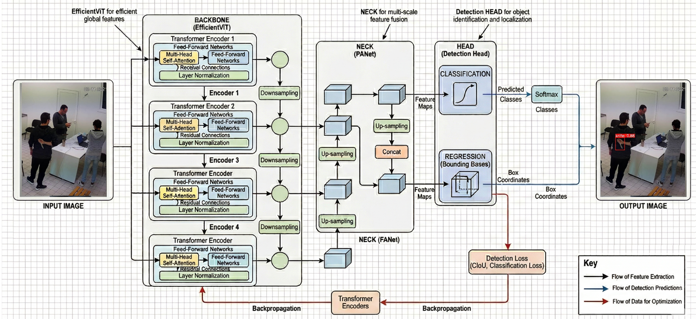

# LinearAttention-Weapon-Detection-EdgeAI

**Linear-attention vision transformer backbones for enhanced weapon detection in edge video surveillance.**

This repository contains the source code, training/evaluation scripts, configuration files, results, and the LaTeX manuscript for **EfficientViT-YOLOv8**, a hybrid object detector in which the CSPDarknet53 backbone of YOLOv8-small is replaced by the **EfficientViT-B1** backbone [[Cai et al., 2023]](#ref-cai2023). EfficientViT-B1 is built around a **Lightweight Multi-Scale Linear Attention (LiteMLA)** mechanism that approximates global self-attention at **O(n)** complexity, enabling scene-level reasoning at a fraction of the compute of standard transformers.

The proposed model is evaluated on the **WeaponSenseV2** dataset [[Berardini et al., 2024a]](#ref-berardini2024dl) using a video-level split that prevents cross-frame data leakage.

---

## Headline result

| Model | AP50 | AP50 Handgun | AP50 Knife | F1 | Params (M) | GFLOPs | FPS |
|---|---|---|---|---|---|---|---|
| YOLOv8s [[Berardini et al., 2024b]](#ref-berardini2024bench) | 44.1 | 66.9 | 21.3 | — | 11.1 | 28.4 | 9.9 † |
| YOLOv8m [[Berardini et al., 2024b]](#ref-berardini2024bench) | 51.2 | 73.2 | 29.1 | — | 25.9 | 79.1 | 4.4 † |
| YOLOv8xl [[Berardini et al., 2024b]](#ref-berardini2024bench) | 58.9 | 78.0 | 39.8 | — | 68.2 | 257.4 | 1.6 † |
| YOLOv8mSR [[Berardini et al., 2025]](#ref-berardini2024edge) | 60.0 | 74.0 | 46.0 | 61.6 | 25.9 | 79.1 | 4.4 † |
| YOLOv8s (baseline) | 48.6 | 49.2 | 48.0 | 53.7 | 11.1 | 28.4 | 182 ‡ |
| YOLOv8m (baseline) | 59.2 | 64.4 | 53.9 | 58.8 | 25.8 | 78.7 | 142 ‡ |
| **EfficientViT-YOLOv8 (proposed)** | **61.6** | 65.8 | **57.4** | **62.8** | **12.5** | **28.0** | 77 ‡ |

<sub>† FPS reported by the original papers on NVIDIA Jetson Nano with TensorRT FP16 quantisation. ‡ FPS measured in this work on The NVIDIA A100 Tensor Core GPU. The two FPS columns are not directly comparable due to the substantially different hardware and runtime; relative ordering within each column is informative. TensorRT FP16 deployment of EfficientViT-YOLOv8 on the same Jetson Nano is left as future work.</sub>

**EfficientViT-YOLOv8 surpasses every published baseline on the WeaponSenseV2 dataset**, including the substantially heavier YOLOv8-extra-large detector (+2.7 AP50) and the SR-augmented YOLOv8-medium variant (+1.6 AP50), while operating with only 12.5 M parameters and 28.0 GFLOPs at 640×640 inference.

---

## Architecture

The proposed EfficientViT-YOLOv8 detector preserves the standard three-block layout of YOLOv8 — backbone, neck, head — and confines the architectural contribution to the backbone, which is replaced by an EfficientViT-B1 instance carrying ImageNet-pretrained weights.



**Backbone — EfficientViT-B1 with LiteMLA attention.** The backbone is a five-stage hierarchical encoder that progressively reduces the spatial resolution of the input frame while increasing the channel depth (channel flow `3 → 16 → 32 → 64 → 128 → 256`; spatial stride `2 → 4 → 8 → 16 → 32`). The first three stages — a stem and two *local stages* built from inverted residual bottleneck blocks [[Howard et al., 2017]](#ref-howard2017) — extract low- and mid-level features through depthwise separable convolutions. The two final *attention stages* are composed of EfficientViT blocks, each pairing a **LiteMLA context module** with a depthwise-convolution local module. LiteMLA replaces the softmax kernel of standard self-attention with a ReLU feature map and exploits the associativity of matrix multiplication to compute attention as `φ(Q) · (φ(K)ᵀ · V)`, reducing the cost from O(n²) to O(n) in the spatial dimension while preserving a global receptive field.

**Neck — Wide PANet.** The Path Aggregation Network neck [[Liu et al., 2018]](#ref-liu2018panet) fuses the three multi-scale feature maps emitted by the backbone (at strides 8, 16, and 32) through top-down and bottom-up paths. The neck channel widths are kept at the YOLOv8-small scale (128 / 256 / 512 channels for the P3 / P4 / P5 detection scales, respectively), aligning the neck capacity with the EfficientViT-B1 backbone.

**Head — YOLOv8 anchor-free Detect.** The detection head is identical to that of YOLOv8-small. It operates on the three fused feature maps and produces, for each spatial location, a class probability vector and a Distribution Focal Loss (DFL)-encoded bounding box [[Li et al., 2020]](#ref-li2020dfl). Predictions are decoded into bounding boxes via the standard YOLOv8 post-processing and refined through Non-Maximum Suppression.

**Training-time considerations.** Two EfficientViT-specific overrides are applied on top of the recipe used for the YOLOv8 baselines: (i) the warmup phase is extended from 3 to 10 epochs to protect the pretrained transformer backbone from the chaotic gradient signal produced during the initial epochs by the randomly initialised neck and head, and (ii) automatic mixed-precision training is disabled, since the inner `φ(K)ᵀ · V` tensor of LiteMLA exhibits a numerical range that overflows in FP16 in the early training phase. All other hyperparameters (SGD, lr0=0.05, momentum=0.9, weight decay 5e-4, batch=32, 300 epochs, linear LR decay, patience=100, mosaic + HSV + flip + translate + scale augmentation) are shared across the three models for a fair comparison.

---

## Repository structure

```
LinearAttention-Weapon-Detection-EdgeAI/
├── configs/
│   └── efficientvit_yolov8.yaml          # Architecture YAML for the proposed model
├── src/
│   ├── models/
│   │   ├── efficientvit_modules.py       # LiteMLA blocks + Ultralytics registration
│   │   └── pretrained_init.py            # ImageNet-B1 weight remapping
│   └── evaluation/
│       ├── evaluate.py                   # Test-set evaluation (Tier-1 inference recipe)
│       └── visualize_results.py          # All publication figures (1–8) + qualitative
├── scripts/
│   └── train.py                          # Training entry point (paper-matched recipe)
├── results/                              # Per-model training logs + best.pt (LFS) + plots
└── requirements.txt
```

---

## Reproducing the experiments

### 1. Environment

```bash
python -m venv .venv
source .venv/bin/activate    # or .venv\Scripts\activate on Windows
pip install -r requirements.txt
```

### 2. Dataset

The WeaponSenseV2 dataset is not redistributed in this repository (see [[Berardini et al., 2024a]](#ref-berardini2024dl) for access). Place the dataset at `data/WeaponSenseV2/` with the following layout:

```
data/WeaponSenseV2/
├── data.yaml
├── train/{images,labels}/
├── val/{images,labels}/
└── test/{images,labels}/
```

### 3. Training

Train all three models (YOLOv8-small, YOLOv8-medium, EfficientViT-YOLOv8) with the paper-matched recipe (SGD, lr0=0.05, batch=32, 300 epochs, linear LR decay, patience=100):

```bash
PYTHONPATH=src python scripts/train.py --model all
```

Or train a single model:

```bash
PYTHONPATH=src python scripts/train.py --model efficientvit
PYTHONPATH=src python scripts/train.py --model yolov8s
PYTHONPATH=src python scripts/train.py --model yolov8m
```

### 4. Evaluation

The evaluation script loads `best.pt` for each model, runs inference on the test set at 896×896 with TTA + IoU=0.6, and writes `results/comparison_results.json`:

```bash
PYTHONPATH=src python -m evaluation.evaluate
```

### 5. Publication figures

Generate the 8 publication figures (bar charts, efficiency scatters, qualitative grids with zoomed insets):

```bash
PYTHONPATH=src python -m evaluation.visualize_results
```

Outputs land in `results/plots/`.

---

## Pretrained weights

The `best.pt` checkpoints for the three retrained models are tracked in this repository via **Git LFS** (~97 MB total):

```
results/efficientvit_yolov8/weights/best.pt   ~25 MB
results/yolov8s/weights/best.pt               ~22 MB
results/yolov8m/weights/best.pt               ~50 MB
```

Clone with LFS support:

```bash
git lfs install
git clone https://github.com/landrytiemani/LinearAttention-Weapon-Detection-EdgeAI.git
```

---

## References

<a id="ref-berardini2024dl"></a>**[Berardini et al., 2024a]** D. Berardini, L. Migliorelli, A. Galdelli, E. Frontoni, A. Mancini, S. Moccia. *A deep-learning framework running on edge devices for handgun and knife detection from indoor video-surveillance cameras.* Multimedia Tools and Applications, 83(7): 19109–19127, 2024.

<a id="ref-berardini2024bench"></a>**[Berardini et al., 2024b]** D. Berardini, L. Migliorelli, A. Galdelli, M. J. Marín-Jiménez. *Benchmark Analysis of YOLOv8 for Edge AI Video-Surveillance Applications.* IEEE International Symposium on Measurements and Networking (M&N), 2024.

<a id="ref-berardini2024edge"></a>**[Berardini et al., 2025]** D. Berardini, L. Migliorelli, A. Galdelli, M. J. Marín-Jiménez. *Edge artificial intelligence and super-resolution for enhanced weapon detection in video surveillance.* Engineering Applications of Artificial Intelligence, 140: 109684, 2025. [DOI: 10.1016/j.engappai.2024.109684](https://doi.org/10.1016/j.engappai.2024.109684)

<a id="ref-cai2023"></a>**[Cai et al., 2023]** H. Cai, J. Li, M. Hu, C. Gan, S. Han. *EfficientViT: Lightweight Multi-Scale Attention for High-Resolution Dense Prediction.* IEEE/CVF International Conference on Computer Vision (ICCV), pp. 17302–17313, 2023.

<a id="ref-howard2017"></a>**[Howard et al., 2017]** A. G. Howard, M. Zhu, B. Chen, D. Kalenichenko, W. Wang, T. Weyand, M. Andreetto, H. Adam. *MobileNets: Efficient Convolutional Neural Networks for Mobile Vision Applications.* arXiv:1704.04861, 2017.

<a id="ref-li2020dfl"></a>**[Li et al., 2020]** X. Li, W. Wang, L. Wu, S. Chen, X. Hu, J. Li, J. Tang, J. Yang. *Generalized Focal Loss: Learning Qualified and Distributed Bounding Boxes for Dense Object Detection.* Advances in Neural Information Processing Systems (NeurIPS), 33: 21002–21012, 2020.

<a id="ref-liu2018panet"></a>**[Liu et al., 2018]** S. Liu, L. Qi, H. Qin, J. Shi, J. Jia. *Path Aggregation Network for Instance Segmentation.* IEEE/CVF Conference on Computer Vision and Pattern Recognition (CVPR), pp. 8759–8768, 2018.

---

## Citation

If you use this code or build on this work, please cite (manuscript in preparation):

```bibtex
@article{landrytiemani2026efficientvit,
  title  = {Linear-attention vision transformer backbone for enhanced weapon detection in edge video surveillance},
  author = {Tiemani, Landry and Berardini, Daniele and Bellur, Srikar},
  year   = {2026},
  note   = {Manuscript in preparation}
}
```

And the foundational EfficientViT and WeaponSenseV2 references:

```bibtex
@inproceedings{cai2023efficientvit,
  title  = {EfficientViT: Lightweight Multi-Scale Attention for High-Resolution Dense Prediction},
  author = {Cai, Han and Li, Junyan and Hu, Muyan and Gan, Chuang and Han, Song},
  booktitle = {ICCV},
  year   = {2023}
}

@article{berardini2024edge,
  title   = {Edge artificial intelligence and super-resolution for enhanced weapon detection in video surveillance},
  author  = {Berardini, Daniele and Migliorelli, Lucia and Galdelli, Alessandro and Mar{\'\i}n-Jim{\'e}nez, Manuel J.},
  journal = {Engineering Applications of Artificial Intelligence},
  volume  = {140},
  pages   = {109684},
  year    = {2025}
}
```

GitHub renders a "Cite this repository" widget from the `CITATION.cff` file at the repo root.

---

## License

MIT License (see [`LICENSE`](LICENSE)).
